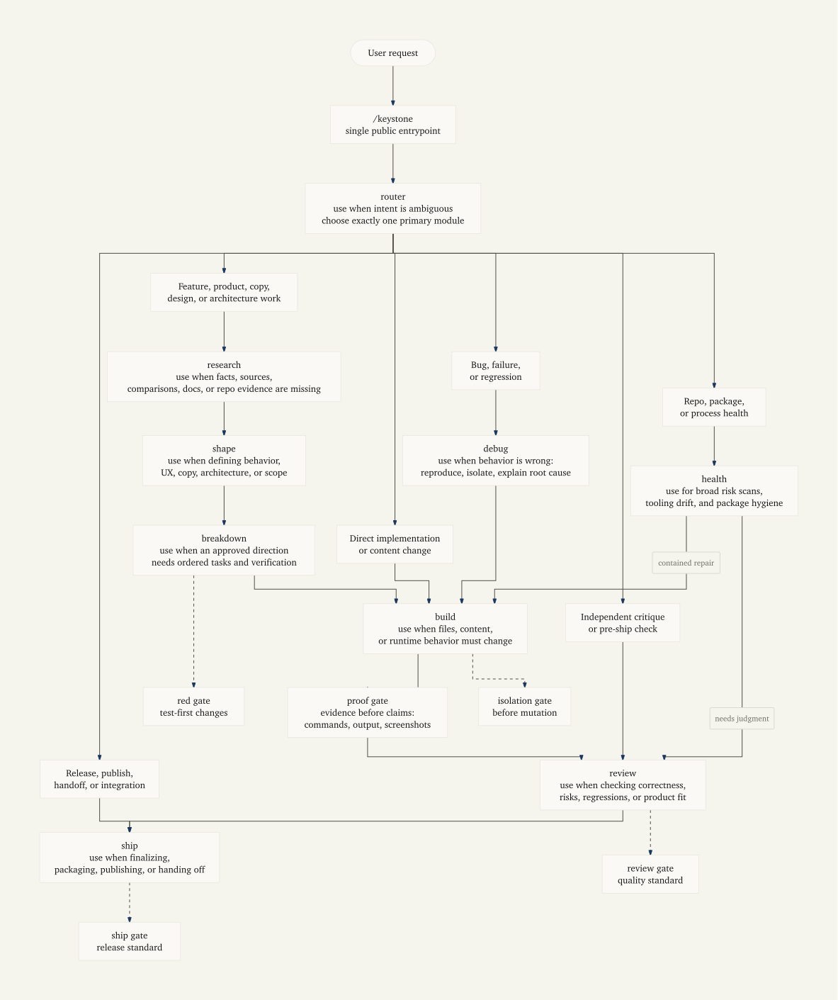

# Keystone

<p align="center">
  
</p>

> One doorway for disciplined AI work: route the task, use the right mode, prove the result.

Keystone is a workflow skill for coding agents. Instead of asking your agent to plan, build, debug, review, and ship all at once, you invoke **one public entrypoint** and Keystone routes the work to the right internal module.

```text
/keystone <your task>
```

Use it when you want an agent to move deliberately: understand first, edit only when safe, verify before claiming success, review before shipping.



## Why use Keystone?

Agents usually fail in predictable ways:

- they edit before understanding the repo
- they treat a plan as proof
- they debug by guessing
- they review while changing files
- they ship without evidence

Keystone turns those habits into a routed workflow:

| You need... | Keystone routes to... |
|---|---|
| decide what kind of work this is | `router` |
| inspect docs, code, releases, or sources | `research` |
| shape product behavior, UX, copy, or architecture | `shape` |
| turn direction into ordered tasks | `breakdown` |
| change files or implement content/code | `build` |
| reproduce and isolate a bug | `debug` |
| critique work without editing it | `review` |
| package, release, or hand off completed work | `ship` |
| scan repo/tooling/package health | `health` |

Internal modules stay internal. You use one public skill: **Keystone**.

## Install

### skills.sh / Agent Skills

```bash
npx skills add static-var/keystone --skill keystone
```

Inspect before installing:

```bash
npx skills add static-var/keystone --list
```

Listing:

```text
https://skills.sh/static-var/keystone
```

### Pi

```bash
pi install npm:@static-var/keystone
```

Then run:

```text
/keystone <task>
```

Optional Pi subagents:

```bash
pi install npm:@tintinweb/pi-subagents
```

Keystone may use `Agent`, `get_subagent_result`, and `steer_subagent` only when the active Pi tool schema exposes them. Do not assume named roles, model selection, thinking controls, or profile support.

### Claude Code

```text
/plugin marketplace add static-var/Keystone
/plugin install keystone@keystone
```

Invoke:

```text
/keystone:keystone <task>
```

### Codex

```bash
codex plugin marketplace add static-var/Keystone --ref main
codex plugin add keystone --marketplace keystone
```

Then ask Codex to use Keystone for routing, or invoke the installed Keystone skill from your Codex surface.

### OpenCode, GitHub Copilot, VS Code Agent Skills

Keystone ships an Agent Skills adapter at:

```text
.agents/skills/keystone/SKILL.md
```

For global use, install from skills.sh or symlink the canonical skill directory:

```bash
npm install -g @static-var/keystone
KS="$(npm root -g)/@static-var/keystone"
mkdir -p ~/.agents/skills
ln -s "$KS/skills/keystone" ~/.agents/skills/keystone
```

## How to use it

Ask Keystone for the workflow you want, not the internal module name.

```text
/keystone diagnose why the release workflow fails and propose the smallest safe fix
```

```text
/keystone turn this product idea into an implementation-ready breakdown
```

```text
/keystone review the current branch for regressions, packaging leaks, and release blockers
```

```text
/keystone ship this change: verify, summarize, and prepare the handoff
```

Keystone will name the selected module, keep the work inside that module’s contract, and hand off only when the task changes shape.

## Configure per-route model overrides

`/keystone-models` opens a cascade picker that lets you pin a specific LLM model and reasoning effort to a Keystone route, or to the default floor that every route inherits.

```text
/keystone-models
```

Scope → key → model → effort. Overrides persist to `~/.config/keystone/models.json` and load on the next session. The scope picker also offers `reset all overrides` (confirm-gated) to clear the file.

Example:

```json
{
  "defaults": { "model": "anthropic/claude-sonnet-4-6", "thinking": "low" },
  "routes": {
    "research": { "model": "anthropic/claude-opus-4-8", "thinking": "high" }
  }
}
```

v1 scopes: `defaults`, `routes` (the `routes` list is auto-discovered from `skills/keystone/modules/*.md`, so adding a new module shows up in the picker on next extension load).

## Common workflows

```text
Feature work:     research → shape → breakdown → build → review → ship
Existing plan:    breakdown → build → review → ship
Direct edit:      build → review → ship
Bug fix:          debug → build → proof gate → review → ship
Health finding:   health → build or health → review
```

## What Keystone protects

Keystone includes small gates that stop common agent mistakes:

- **checkpoint gate** — make the next module/event explicit before any final response
- **isolation gate** — check branch/worktree/scope before mutation
- **red gate** — establish a failing check when practical
- **proof gate** — show evidence before success claims
- **review gate** — separate critique from fixing
- **ship gate** — verify the handoff is complete

## Project status

- npm package: `@static-var/keystone`
- public skill: `keystone`
- license: MIT
- supported surfaces: Pi, skills.sh Agent Skills, Claude Code, Codex, OpenCode, GitHub Copilot / VS Code-compatible hosts

For architecture, packaging, validation, and maintainer commands, read [`HOW_IT_WORKS.md`](HOW_IT_WORKS.md).
